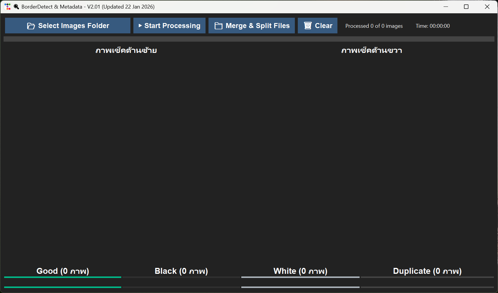

# 🔍 BorderDetect & Metadata - V2.01

**BorderDetect & Metadata** เป็นเครื่องมืออเนกประสงค์สำหรับช่างภาพและนักจัดการข้อมูลภาพ ช่วยตรวจสอบคุณภาพของรูปภาพจำนวนมากโดยอัตโนมัติ (Batch Processing) ทั้งการตรวจหาขอบภาพที่ผิดปกติ, ค้นหาภาพซ้ำ และล้างข้อมูล Metadata เพื่อความเป็นส่วนตัวหรือเตรียมข้อมูลสำหรับ AI

---

## ✨ ฟีเจอร์หลัก (Key Features)

โปรแกรมถูกออกแบบมาเพื่อแก้ปัญหาการจัดการคลังภาพขนาดใหญ่ โดยมีฟังก์ชันหลัก 4 ด้าน:

### 1. 🖼️ การตรวจขอบภาพ (Border Detection)
* **Black/White Border:** ตรวจสอบรูปภาพที่มีขอบสีดำหรือสีขาวมากเกินไป ซึ่งมักเกิดจากการสแกนหรือการ Crop ที่ผิดพลาด
* **Visual Preview:** แสดงภาพที่กำลังตรวจสอบแบบ Real-time ทั้งด้านซ้ายและด้านขวา

### 2. 👯 การตรวจหาภาพซ้ำ (Duplicate Detection)
* **Deep Scan:** ตรวจสอบไฟล์ภาพที่มีลักษณะเหมือนกันเพื่อช่วยประหยัดพื้นที่จัดเก็บข้อมูล
* **Status Tracking:** ระบบจะแยกจำนวนภาพซ้ำออกมาให้เห็นชัดเจนที่แถบด้านล่าง

### 3. 🛡️ การลบ Metadata
* **Privacy First:** ลบข้อมูลที่ฝังอยู่ในไฟล์ภาพ (EXIF data) เช่น สถานที่ถ่ายภาพ, รุ่นกล้อง และค่าพารามิเตอร์ต่างๆ เพื่อความปลอดภัยก่อนนำภาพไปใช้งานต่อ

### 4. 📁 การจัดการไฟล์อัตโนมัติ (File Categorization)
เมื่อประมวลผลเสร็จ โปรแกรมจะแยกหมวดหมู่ภาพให้โดยอัตโนมัติ:
* **Good:** ภาพปกติที่ผ่านการตรวจสอบ
* **Black:** ภาพที่มีขอบดำ
* **White:** ภาพที่มีขอบขาว
* **Duplicate:** ภาพที่ซ้ำกัน

---

## 🚀 วิธีการใช้งาน (How to Use)

1. **เลือกโฟลเดอร์:** กดปุ่ม `Select Images Folder` เพื่อเลือกโฟลเดอร์ที่เก็บรูปภาพของคุณ
2. **เริ่มทำงาน:** กดปุ่ม `Start Processing` เพื่อเริ่มระบบตรวจสอบอัตโนมัติ
3. **จัดการไฟล์:** เมื่อตรวจสอบเสร็จ คุณสามารถใช้ปุ่ม `Merge & Split Files` เพื่อจัดการรวมหรือแยกไฟล์ตามหมวดหมู่ที่ตรวจพบ
4. **ล้างค่า:** ใช้ปุ่ม `Clear` หากต้องการเริ่มการทำงานใหม่กับชุดภาพอื่น

---

## 📊 ส่วนแสดงผลสถานะ (Status Bar)
โปรแกรมมาพร้อมกับแถบสถานะที่เข้าใจง่าย แบ่งตามสีเพื่อให้คุณทราบผลลัพธ์ได้ทันที:
* **Processed:** แสดงจำนวนภาพที่ทำเสร็จแล้วเทียบกับทั้งหมด
* **Time:** แสดงเวลาที่ใช้ในการประมวลผล
* **Counters:** สรุปจำนวนภาพในแต่ละหมวดหมู่ (Good, Black, White, Duplicate)

---

## 🛠 ข้อมูลทางเทคนิค (Technical Details)
* **Build Date:** Updated 22 Jan 2026
* **Version:** 2.01
* **Language:** พัฒนาด้วย Python (GUI)

---

## 📄 License
จัดทำโดย wiwatapi. ข้อมูลในโปรแกรมนี้ใช้สำหรับการจัดการและทำความสะอาดข้อมูลภาพส่วนบุคคล
